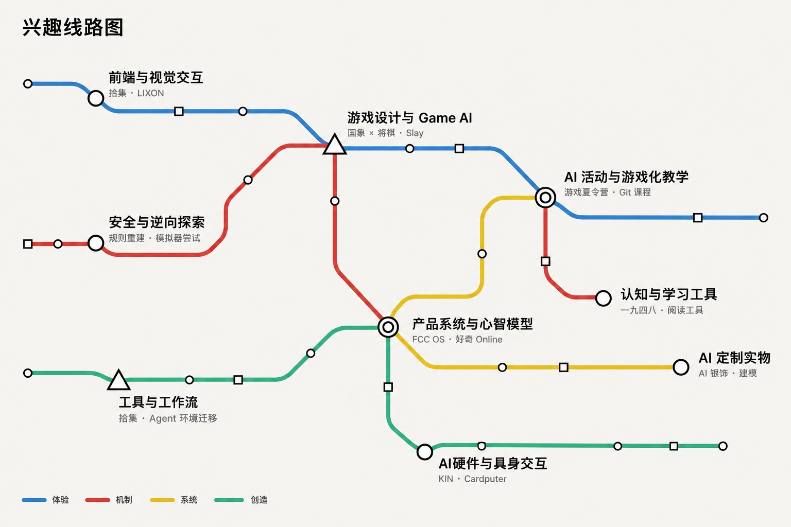
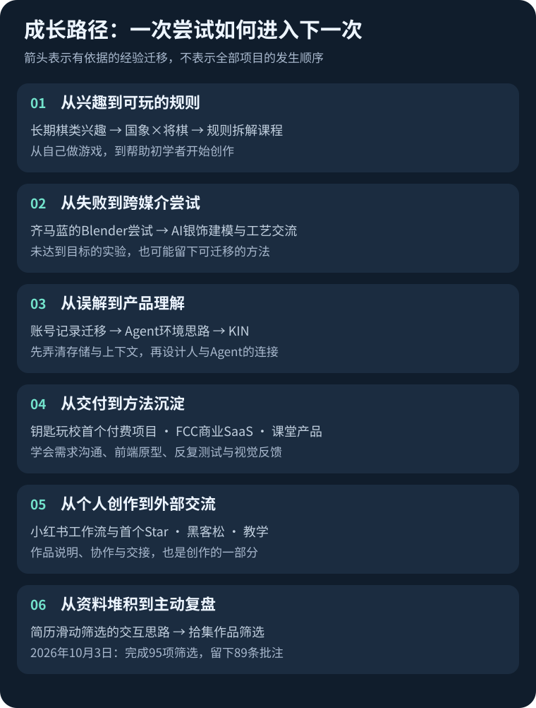

# 刘行 / chichu

**跨界 AI 实践者。拆解规则，用原型检验想法。**

我在成都好奇学习社区自主学习。从棋类游戏、交互网站到 Agent 硬件，我喜欢理解一个系统为什么这样运转，再用 AI 把自己的理解做成能玩、能用、能体验的东西。在真实项目、教学和合作中，我也不断修正这些理解。

*AI builder exploring games, interfaces & human–agent interaction.*

[重点案例](cases/SELECTED.md) · [完整兴趣目录](CATALOG.md) · [成长节点](MILESTONES.md) · [项目之间的关系](RELATIONSHIPS.md)

## 先认识我的三个想法

**改一个规则，看看会发生什么。** 国象与将棋共用棋盘、把熟悉人物写成卡牌机制、让地铁自己跑酷——我喜欢从修改预设找到玩法。这也是我教《质疑一个规则》的起点。

**先让想法可以体验。** 拾集把整理资料变成“皇帝批奏折”；商业项目则让我学会先画流程、做前端原型，在沟通和测试中修正需求。交互会影响一个人愿不愿意开始，以及能不能继续。

**让一次创作留下下一次用得上的东西。** 齐马蓝的 Blender 尝试没有达到预期，经验后来用到了银饰；自己做游戏踩过的坑，后来变成版本保存、截图反馈与任务拆分的教学方法。

## 如果只有两分钟

| 作品 | 我在探索什么 | 实践与收获 |
| --- | --- | --- |
| [国象 × 将棋](https://github.com/xing0325/chess-shogi) | 两套规则能否共存？ | 9×9融合对战；把走子、打入和升变变成具体取舍，平衡仍在探索。 |
| [拾集 pick.](cases/PICK.md) | 怎样让人愿意整理枯燥资料？ | 滑动、批注、撤销与导出；实际完成95项条目复盘，学习设计低阻力流程。 |
| [Slay the Curiosity](https://github.com/AGdafu/slay-the-curiosity) | 人物性格怎样变成玩法？ | 借鉴《杀戮尖塔》，参与早期角色与卡牌制作，试玩后交接同学；现仓库含后续贡献。 |
| [KIN](https://github.com/xing0325/kin-hackathon) | Agent如何帮助人在现实中连接？ | 发起并主导整体实现，与团队结合网页和ESP32终端；学习跨软件、硬件与产品流程协作。 |
| [AI银饰探索](https://github.com/xing0325/anima-rings) | AI创作如何走出屏幕？ | 建模、品牌展示与工艺交流；将先前Blender经验用于新媒介，未宣称量产。 |
| [LIXON](https://github.com/xing0325/lixon) | 审美如何成为可积累的方法？ | F1个人表达、流体与微动效；从参考拆解走向[可复用动效库](https://github.com/xing0325/web-anim-cookbook)。 |

想深入看游戏与创作方法，可以从[三个重点案例](cases/SELECTED.md)开始。想看真实交付，可以看[钥匙玩校](https://github.com/xing0325/kiidschool)、[龟谷择校](https://github.com/xing0325/guigu-japan-study)与下方产品实践。

## 我的兴趣图谱

下面按原有九组兴趣展开。一个项目可以关联多个兴趣；同一作品线的版本和子模块会注明，避免把仓库数量当成作品数量。图谱可点击放大，展开项和[完整目录](CATALOG.md)提供链接与学习收获。

<strong>前端与视觉交互</strong> · 29条探索线

- **[拾集 pick.](cases/PICK.md)**：把作品整理变成逐张判断、批注与导出。学到：轻快的操作要与撤销、待定、恢复一起设计；已完成95项条目的自用复盘。

- **[龟谷日本留学学校地图](https://github.com/xing0325/guigu-japan-study)**：真实商业需求给交互设计提供约束，页面要服务择校任务，而不仅是视觉偏好。

- **Cardputer 中登固件（暂无公开入口）**：尝试将人物语言、语音交互和小游戏放入实体终端；具体已跑通功能需核对固件，不能由设计笔记直接推断。

- **[KIN Agent 社交网络与实体终端](https://github.com/xing0325/kin-hackathon)**：把Agent连接设计为有实体反馈和双方确认的体验；硬件演示是后来协作平台方向的前一阶段。

- **彳亍平面设计与视觉资产（暂无公开入口）**：可以通过历次海报对照观察自己的视觉判断、工具使用和AI能力如何共同变化。 同线索：即兴戏剧海报实验（暂无公开入口）。

- **Funshine / FCC 品牌网站系列（暂无公开入口）**：通过参考站拆解与方向调整，为客户探索合适的品牌表达；要区分复刻研究和最终交付。

- **[haoqi-online-new](https://github.com/xing0325/haoqi-online-new)**：作为好奇Online的另一版前端原型，提供信息架构探索的证据；尚无独立学习叙述，不重复计数。

- **[kiidschool](https://github.com/xing0325/kiidschool)**：在缺少原始素材时，用AI编写采集工具恢复公众号文字、图片、GIF与排版，让真实交付继续推进。 同线索：钥匙玩校内容与营期资料（暂无公开入口）。

- **[LIXON 个人作品集与 Norris 动效研究](https://github.com/xing0325/lixon)**：反复调试流体效果，并把参考站的微动效拆解成可复用库；个人审美可以转成长期积累的实现方法。 同线索：Vibe Coder Dashboard（暂无公开入口）。

- **简历滑动筛选工作台（暂无公开入口）**：低认知摩擦的交互可以改变人对枯燥任务的参与意愿；左右滑和批注服务于工作流程。

- **青听计划（暂无公开入口）**：早期公益与纪录片合作锻炼推进真实项目的能力；奖项名次尚待证据，不直接写成获奖成果。

- **[mofazhusha](https://github.com/xing0325/mofazhusha)**：反复测试和对齐需求后，认识到应先由人设计页面与跳转，再用画板截图让AI准确理解；人的设计判断很重要。

- **[xiaohongshu-preview](https://github.com/xing0325/xiaohongshu-preview)**：把项目上下文、HTML图文和发布操作接成工作流；第一次认真打磨README并获得首个Star，也看见配图质量和长期使用仍需打磨。 同线索：小红书卡片视觉实验（暂无公开入口）。

- **[彳亍视觉演讲网站](https://github.com/xing0325/chichu-visual-talk)**：尝试用HTML替代PPT，让演讲具有互动性和更自由的排版；是否首次仍保留我的“可能”口径。 同线索：[film-mechanisms-defense](https://github.com/xing0325/film-mechanisms-defense)、[jingqi-share](https://github.com/xing0325/jingqi-share)、[lapian](https://github.com/xing0325/lapian)。

- **[齐马蓝交互体验](https://github.com/xing0325/zima)**：第一次尝试让AI操作Blender但未达到想要的效果；失败提供了模型处理经验，后来迁移到银饰设计。

- **[anima-rings](https://github.com/xing0325/anima-rings)**：从观察实体工艺进入AI建模和品牌展示；前次Blender失败经验得到复用，内容反馈进一步带来设计交流与合作询问。 同线索：[jewelry](https://github.com/xing0325/jewelry)、Jewelry Vibe Coder 研究档案（暂无公开入口）、Occupied Clone（暂无公开入口）。

- **[ditie-paoku](https://github.com/xing0325/ditie-paoku)**：改写一个短语的语法关系，也能改写游戏主体与规则；将语言幽默转成操作体验，剧情仍待构思。

- **EDCoder／Vibe Pen（暂无公开入口）**：以手指动作、人因与机械反馈重新思考输入设备；形成追求实体触感的硬件审美，目前按概念设计呈现。

- **[qiantaici-decoder](https://github.com/xing0325/qiantaici-decoder)**：将课程概念与回复时机变成交互练习；体验设计可帮助讨论概念，但不能据此声称具有心理诊断效力。

- **[the-news-room](https://github.com/xing0325/the-news-room)**：把个人记录转成多家报社的角色视角，探索独立Agent角色与组织关系；描述了很完整的构想，实现范围仍需逐项验证。

- **[warhol-factory](https://github.com/xing0325/warhol-factory)**：给喜欢的艺术家设计网站，尝试让视觉语言回应人物的创作观念，而非套用通用模板。

- **[dazi-juice](https://github.com/xing0325/dazi-juice)**：打字练习让自己关注动效、输入反馈与沉浸感，探索交互如何带来节奏和爽感。

- **[dengweir-shop](https://github.com/xing0325/dengweir-shop)**：把网页变成戏剧现场与观众互动的道具，学习让技术服务表演语境。

- **gaoyou-learning（暂无公开入口）**：从撮合家教转向设计课程节奏、验收和可见进度；认识到平台应解决教学过程的问题，许多功能仍是设计愿景。

- **[odysseus-zh-CN](https://github.com/xing0325/odysseus-zh-CN)**：通过页面汉化和测试降低使用门槛，并参与开源传播；“全网首个汉化”尚未外部核实，不作公开断言。

- **大数 Googology 页面（暂无公开入口）**：尝试用运算与增长率的连续变化解释超大数，把抽象知识组织成可探索的叙事。 同线索：大数趣交互页面（暂无公开入口）。

- **[hezi-vs-zhongdeng](https://github.com/xing0325/hezi-vs-zhongdeng)**：把个人站流体技术复用到人物内容，验证同一交互在不同语境中的传播潜力；相关视频12万点赞为我的个人反馈记录。

- **FCC OS（暂无公开入口）**：第一次商业SaaS实践中参与架构设计、需求拆解和跨角色沟通；画板是展示思考过程的重要证据。

- **[late-penalty](https://github.com/xing0325/late-penalty)**：把迟到管理设计为带随机性的参与机制，让规则有执行力又保留社团氛围；这是小而具体的游戏化设计。

- **[Slay the Curiosity](https://github.com/AGdafu/slay-the-curiosity)**：把熟悉人物的性格映射为角色、技能与卡组，发现自己对机制设计有强烈热情；试玩反馈和交接同学构成真实迭代经历。

[这一兴趣下的完整说明](CATALOG.md#interest-1)

<strong>游戏设计与Game AI</strong> · 14条探索线

- **股票时光机／王琦的大黑基金（暂无公开入口）**：把游戏做完整，需要考虑营期节奏、主持与参与方式及测试；下一步想用实际使用数据检验设计效果。

- **Cardputer 中登固件（暂无公开入口）**：尝试将人物语言、语音交互和小游戏放入实体终端；具体已跑通功能需核对固件，不能由设计笔记直接推断。

- **[chess-shogi](https://github.com/xing0325/chess-shogi)**：把长期棋类兴趣转成可执行规则，在棋盘、打入、升变与平衡性之间做取舍。

- **皇室战争确定性模拟器（暂无公开入口）**：尝试从数据与规则重建走向自我对战训练；需区分开始训练、训练跑通与取得有效策略三种结果。

- **AI 游戏设计夏令营教学包（暂无公开入口）**：把自己会做转化为初学者能做：拆解规则、保存版本、给AI视觉反馈，并沉淀成课程和SOP。

- **[mofazhusha](https://github.com/xing0325/mofazhusha)**：反复测试和对齐需求后，认识到应先由人设计页面与跳转，再用画板截图让AI准确理解；人的设计判断很重要。

- **尼连禅河（暂无公开入口）**：尝试把与僧人交流后的思想兴趣转成可体验的游戏；主题动机明确，Demo打磨程度仍有限。

- **[ditie-paoku](https://github.com/xing0325/ditie-paoku)**：改写一个短语的语法关系，也能改写游戏主体与规则；将语言幽默转成操作体验，剧情仍待构思。

- **[qiantaici-decoder](https://github.com/xing0325/qiantaici-decoder)**：将课程概念与回复时机变成交互练习；体验设计可帮助讨论概念，但不能据此声称具有心理诊断效力。

- **[the-news-room](https://github.com/xing0325/the-news-room)**：把个人记录转成多家报社的角色视角，探索独立Agent角色与组织关系；描述了很完整的构想，实现范围仍需逐项验证。

- **[dazi-juice](https://github.com/xing0325/dazi-juice)**：打字练习让自己关注动效、输入反馈与沉浸感，探索交互如何带来节奏和爽感。

- **[dengweir-shop](https://github.com/xing0325/dengweir-shop)**：把网页变成戏剧现场与观众互动的道具，学习让技术服务表演语境。

- **[late-penalty](https://github.com/xing0325/late-penalty)**：把迟到管理设计为带随机性的参与机制，让规则有执行力又保留社团氛围；这是小而具体的游戏化设计。

- **[Slay the Curiosity](https://github.com/AGdafu/slay-the-curiosity)**：把熟悉人物的性格映射为角色、技能与卡组，发现自己对机制设计有强烈热情；试玩反馈和交接同学构成真实迭代经历。

[这一兴趣下的完整说明](CATALOG.md#interest-2)

<strong>安全与逆向探索</strong> · 3条探索线

- **皇室战争确定性模拟器（暂无公开入口）**：尝试从数据与规则重建走向自我对战训练；需区分开始训练、训练跑通与取得有效策略三种结果。

- **Kindle Highlight Sync（暂无公开入口）**：把设备内的划线带进自己能管理、也能给AI使用的笔记流程；接口取得与同步实现还需技术核验。

- **Omarchy 安装与修复实验（暂无公开入口）**：通过外置盘启动与双系统实践学习Linux环境，积累跨系统工作经验。

这里保留学习兴趣与规则重建线索；没有把开始训练写成已经获得有效Game AI，也没有把使用上游工具写成独立开发。

[这一兴趣下的完整说明](CATALOG.md#interest-3)

<strong>AI活动与游戏化教学</strong> · 12条探索线

- **股票时光机／王琦的大黑基金（暂无公开入口）**：把游戏做完整，需要考虑营期节奏、主持与参与方式及测试；下一步想用实际使用数据检验设计效果。

- **curi-online（暂无公开入口）**：第一次尝试搭建SaaS，发现自己对系统、角色和模块之间的关系有持续热情。 同线索：credit-score（暂无公开入口）。

- **简历滑动筛选工作台（暂无公开入口）**：低认知摩擦的交互可以改变人对枯燥任务的参与意愿；左右滑和批注服务于工作流程。

- **青听计划（暂无公开入口）**：早期公益与纪录片合作锻炼推进真实项目的能力；奖项名次尚待证据，不直接写成获奖成果。

- **AI 游戏设计夏令营教学包（暂无公开入口）**：把自己会做转化为初学者能做：拆解规则、保存版本、给AI视觉反馈，并沉淀成课程和SOP。

- **[mofazhusha](https://github.com/xing0325/mofazhusha)**：反复测试和对齐需求后，认识到应先由人设计页面与跳转，再用画板截图让AI准确理解；人的设计判断很重要。

- **[vibe-coding-class](https://github.com/xing0325/vibe-coding-class)**：备课推动自己学习Git与GitHub协作，再用树状图、逐步引导和镜像界面帮助同学理解；教学本身也是学习方式。

- **[彳亍视觉演讲网站](https://github.com/xing0325/chichu-visual-talk)**：尝试用HTML替代PPT，让演讲具有互动性和更自由的排版；是否首次仍保留我的“可能”口径。 同线索：[film-mechanisms-defense](https://github.com/xing0325/film-mechanisms-defense)、[jingqi-share](https://github.com/xing0325/jingqi-share)、[lapian](https://github.com/xing0325/lapian)。

- **[dengweir-shop](https://github.com/xing0325/dengweir-shop)**：把网页变成戏剧现场与观众互动的道具，学习让技术服务表演语境。

- **BIBABO（暂无公开入口）**：第一份实习中学习GitHub团队协作，认识到简单功能也需要反复打磨；个人负责模块仍需补充。

- **[late-penalty](https://github.com/xing0325/late-penalty)**：把迟到管理设计为带随机性的参与机制，让规则有执行力又保留社团氛围；这是小而具体的游戏化设计。

- **[Slay the Curiosity](https://github.com/AGdafu/slay-the-curiosity)**：把熟悉人物的性格映射为角色、技能与卡组，发现自己对机制设计有强烈热情；试玩反馈和交接同学构成真实迭代经历。

- **[黑客松展厅与投票中心](https://github.com/xing0325/manycore-hackathon-voting-hub)**：把助教现场遇到的提交、展示与投票需求做成流程。学到：组织经验可以转化为让参与者看见彼此作品的工具。

[这一兴趣下的完整说明](CATALOG.md#interest-4)

<strong>产品系统与心智模型</strong> · 19条探索线

- **[拾集 pick.](cases/PICK.md)**：把作品整理变成逐张判断、批注与导出。学到：轻快的操作要与撤销、待定、恢复一起设计；已完成95项条目的自用复盘。

- **股票时光机／王琦的大黑基金（暂无公开入口）**：把游戏做完整，需要考虑营期节奏、主持与参与方式及测试；下一步想用实际使用数据检验设计效果。

- **[龟谷日本留学学校地图](https://github.com/xing0325/guigu-japan-study)**：真实商业需求给交互设计提供约束，页面要服务择校任务，而不仅是视觉偏好。

- **[止刷 · Curbox／Calling 三番战](https://github.com/curbox-app/curbox-android)**：把自用需求推进到手机产品，并开始思考付费价值；准备售卖不等于已经获得收入。

- **Deota 黑客松 Agent 协作平台（暂无公开入口）**：黑客松反馈推动方向从实体Agent连接转向垂直场景协作；早期账号与环境迁移经验能转化为新的产品结构。 同线索：[KIN Agent 社交网络与实体终端](https://github.com/xing0325/kin-hackathon)、[kin-agent-connect](https://github.com/xing0325/kin-agent-connect)。

- **[calling-suishoji](https://github.com/xing0325/calling-suishoji)**：从自己的使用需求出发，把意识流输入转成行动与觉察；同时认识到自用价值不自动等于普遍市场需求。 同线索：Manus 早期项目压缩包（暂无公开入口）。

- **curi-online（暂无公开入口）**：第一次尝试搭建SaaS，发现自己对系统、角色和模块之间的关系有持续热情。 同线索：[haoqi-online-new](https://github.com/xing0325/haoqi-online-new)、credit-score（暂无公开入口）。

- **Funshine / FCC 品牌网站系列（暂无公开入口）**：通过参考站拆解与方向调整，为客户探索合适的品牌表达；要区分复刻研究和最终交付。

- **[kiidschool](https://github.com/xing0325/kiidschool)**：在缺少原始素材时，用AI编写采集工具恢复公众号文字、图片、GIF与排版，让真实交付继续推进。

- **[mofazhusha](https://github.com/xing0325/mofazhusha)**：反复测试和对齐需求后，认识到应先由人设计页面与跳转，再用画板截图让AI准确理解；人的设计判断很重要。

- **Telemachus（暂无公开入口）**：第一次把自己做的手机应用装到设备上，理解桌面功能到移动体验的迁移；这是实际创作信心的节点。

- **[the-news-room](https://github.com/xing0325/the-news-room)**：把个人记录转成多家报社的角色视角，探索独立Agent角色与组织关系；描述了很完整的构想，实现范围仍需逐项验证。

- **项目坞／Project Dashboard（暂无公开入口）**：失败尝试帮助自己明确项目管理还需要预览、版本和状态；自己的作品应用市场仍是待继续实现的目标。

- **[claude-account-switch-migration](https://github.com/xing0325/claude-account-switch-migration)**：把记录、Skill与插件状态一起考虑，形成可复制Agent环境的思路，并影响后来的KIN；隔离效果仍依赖具体配置。

- **gaoyou-learning（暂无公开入口）**：从撮合家教转向设计课程节奏、验收和可见进度；认识到平台应解决教学过程的问题，许多功能仍是设计愿景。

- **[hezi-vs-zhongdeng](https://github.com/xing0325/hezi-vs-zhongdeng)**：把个人站流体技术复用到人物内容，验证同一交互在不同语境中的传播潜力；相关视频12万点赞为我的个人反馈记录。

- **BIBABO（暂无公开入口）**：第一份实习中学习GitHub团队协作，认识到简单功能也需要反复打磨；个人负责模块仍需补充。

- **FCC OS（暂无公开入口）**：第一次商业SaaS实践中参与架构设计、需求拆解和跨角色沟通；画板是展示思考过程的重要证据。

- **Obsidian 规划可视化（暂无公开入口）**：为了本地统一规划而自建插件，最后选择第三方工具；学会权衡适我化需求和继续开发的成本。

- **EPUB ADHD Remixer（暂无公开入口）**：尝试在章节前连接个人兴趣与共鸣点，以降低开始阅读的阻力；效果尚无实测结论。

[这一兴趣下的完整说明](CATALOG.md#interest-5)

<strong>工具与工作流</strong> · 26条探索线

- **[拾集 pick.](cases/PICK.md)**：把作品整理变成逐张判断、批注与导出。学到：轻快的操作要与撤销、待定、恢复一起设计；已完成95项条目的自用复盘。

- **[止刷 · Curbox／Calling 三番战](https://github.com/curbox-app/curbox-android)**：把自用需求推进到手机产品，并开始思考付费价值；准备售卖不等于已经获得收入。

- **Deota 黑客松 Agent 协作平台（暂无公开入口）**：黑客松反馈推动方向从实体Agent连接转向垂直场景协作；早期账号与环境迁移经验能转化为新的产品结构。 同线索：[kin-agent-connect](https://github.com/xing0325/kin-agent-connect)。

- **[calling-suishoji](https://github.com/xing0325/calling-suishoji)**：从自己的使用需求出发，把意识流输入转成行动与觉察；同时认识到自用价值不自动等于普遍市场需求。 同线索：Manus 早期项目压缩包（暂无公开入口）。

- **curi-online（暂无公开入口）**：第一次尝试搭建SaaS，发现自己对系统、角色和模块之间的关系有持续热情。

- **[kiidschool](https://github.com/xing0325/kiidschool)**：在缺少原始素材时，用AI编写采集工具恢复公众号文字、图片、GIF与排版，让真实交付继续推进。 同线索：钥匙玩校内容与营期资料（暂无公开入口）。

- **[LIXON 个人作品集与 Norris 动效研究](https://github.com/xing0325/lixon)**：反复调试流体效果，并把参考站的微动效拆解成可复用库；个人审美可以转成长期积累的实现方法。 同线索：Vibe Coder Dashboard（暂无公开入口）。

- **简历滑动筛选工作台（暂无公开入口）**：低认知摩擦的交互可以改变人对枯燥任务的参与意愿；左右滑和批注服务于工作流程。

- **AI 游戏设计夏令营教学包（暂无公开入口）**：把自己会做转化为初学者能做：拆解规则、保存版本、给AI视觉反馈，并沉淀成课程和SOP。

- **sessionss（暂无公开入口）**：并行开发的曲折尝试让自己转向Git worktree；不是所有复杂流程都值得强行简化，学习已有方法可能更有效。

- **[vibe-coding-class](https://github.com/xing0325/vibe-coding-class)**：备课推动自己学习Git与GitHub协作，再用树状图、逐步引导和镜像界面帮助同学理解；教学本身也是学习方式。

- **[xiaohongshu-preview](https://github.com/xing0325/xiaohongshu-preview)**：把项目上下文、HTML图文和发布操作接成工作流；第一次认真打磨README并获得首个Star，也看见配图质量和长期使用仍需打磨。 同线索：小红书卡片视觉实验（暂无公开入口）、小红书发布脚本（暂无公开入口）。

- **[anima-rings](https://github.com/xing0325/anima-rings)**：从观察实体工艺进入AI建模和品牌展示；前次Blender失败经验得到复用，内容反馈进一步带来设计交流与合作询问。

- **[chichu_habit](https://github.com/xing0325/chichu_habit)**：把跨Agent重复解释的习惯整理成持续维护的上下文；需要保留更新来源和版本，而非把记忆视为一次性文档。

- **Kindle Highlight Sync（暂无公开入口）**：把设备内的划线带进自己能管理、也能给AI使用的笔记流程；接口取得与同步实现还需技术核验。

- **Telemachus（暂无公开入口）**：第一次把自己做的手机应用装到设备上，理解桌面功能到移动体验的迁移；这是实际创作信心的节点。

- **[the-news-room](https://github.com/xing0325/the-news-room)**：把个人记录转成多家报社的角色视角，探索独立Agent角色与组织关系；描述了很完整的构想，实现范围仍需逐项验证。

- **项目坞／Project Dashboard（暂无公开入口）**：失败尝试帮助自己明确项目管理还需要预览、版本和状态；自己的作品应用市场仍是待继续实现的目标。

- **Claude Groups 恢复工具（暂无公开入口）**：从误以为记录在云端出发设计迁移，后来修正对本地数据的认知；先弄清存储机制比直接造工具更重要。 同线索：[claude-account-switch-migration](https://github.com/xing0325/claude-account-switch-migration)。

- **[odysseus-zh-CN](https://github.com/xing0325/odysseus-zh-CN)**：通过页面汉化和测试降低使用门槛，并参与开源传播；“全网首个汉化”尚未外部核实，不作公开断言。

- **BIBABO（暂无公开入口）**：第一份实习中学习GitHub团队协作，认识到简单功能也需要反复打磨；个人负责模块仍需补充。

- **FCC OS（暂无公开入口）**：第一次商业SaaS实践中参与架构设计、需求拆解和跨角色沟通；画板是展示思考过程的重要证据。

- **Obsidian 规划可视化（暂无公开入口）**：为了本地统一规划而自建插件，最后选择第三方工具；学会权衡适我化需求和继续开发的成本。

- **Omarchy 安装与修复实验（暂无公开入口）**：通过外置盘启动与双系统实践学习Linux环境，积累跨系统工作经验。

- **OpenCLI 扩展实验（暂无公开入口）**：认识到把网页操作封装成CLI可以帮助Agent接入流程；原项目属于开源依赖，自己的扩展贡献尚未确认。

- **[Pixel IMS Guardian](https://github.com/ryfineZ/carrier-ims-for-pixel)**：使用现成开源项目和Agent完成设备适配流程；成果属于集成使用，不宣称独立开发底层修复工具。

- **EPUB ADHD Remixer（暂无公开入口）**：尝试在章节前连接个人兴趣与共鸣点，以降低开始阅读的阻力；效果尚无实测结论。

[这一兴趣下的完整说明](CATALOG.md#interest-6)

<strong>AI硬件与具身交互</strong> · 5条探索线

- **Cardputer 中登固件（暂无公开入口）**：尝试将人物语言、语音交互和小游戏放入实体终端；具体已跑通功能需核对固件，不能由设计笔记直接推断。

- **Deota 黑客松 Agent 协作平台（暂无公开入口）**：黑客松反馈推动方向从实体Agent连接转向垂直场景协作；早期账号与环境迁移经验能转化为新的产品结构。 同线索：[KIN Agent 社交网络与实体终端](https://github.com/xing0325/kin-hackathon)、[kin-agent-connect](https://github.com/xing0325/kin-agent-connect)。

- **[齐马蓝交互体验](https://github.com/xing0325/zima)**：第一次尝试让AI操作Blender但未达到想要的效果；失败提供了模型处理经验，后来迁移到银饰设计。

- **EDCoder／Vibe Pen（暂无公开入口）**：以手指动作、人因与机械反馈重新思考输入设备；形成追求实体触感的硬件审美，目前按概念设计呈现。

- **[Pixel IMS Guardian](https://github.com/ryfineZ/carrier-ims-for-pixel)**：使用现成开源项目和Agent完成设备适配流程；成果属于集成使用，不宣称独立开发底层修复工具。

[这一兴趣下的完整说明](CATALOG.md#interest-7)

<strong>AI定制实物</strong> · 2条探索线

- **[齐马蓝交互体验](https://github.com/xing0325/zima)**：第一次尝试让AI操作Blender但未达到想要的效果；失败提供了模型处理经验，后来迁移到银饰设计。

- **[anima-rings](https://github.com/xing0325/anima-rings)**：从观察实体工艺进入AI建模和品牌展示；前次Blender失败经验得到复用，内容反馈进一步带来设计交流与合作询问。 同线索：[jewelry](https://github.com/xing0325/jewelry)、Jewelry Vibe Coder 研究档案（暂无公开入口）、Occupied Clone（暂无公开入口）。

[这一兴趣下的完整说明](CATALOG.md#interest-8)

<strong>认知与学习工具</strong> · 12条探索线

- **[止刷 · Curbox／Calling 三番战](https://github.com/curbox-app/curbox-android)**：把自用需求推进到手机产品，并开始思考付费价值；准备售卖不等于已经获得收入。

- **[calling-suishoji](https://github.com/xing0325/calling-suishoji)**：从自己的使用需求出发，把意识流输入转成行动与觉察；同时认识到自用价值不自动等于普遍市场需求。

- **[vibe-coding-class](https://github.com/xing0325/vibe-coding-class)**：备课推动自己学习Git与GitHub协作，再用树状图、逐步引导和镜像界面帮助同学理解；教学本身也是学习方式。

- **尼连禅河（暂无公开入口）**：尝试把与僧人交流后的思想兴趣转成可体验的游戏；主题动机明确，Demo打磨程度仍有限。

- **[chichu_habit](https://github.com/xing0325/chichu_habit)**：把跨Agent重复解释的习惯整理成持续维护的上下文；需要保留更新来源和版本，而非把记忆视为一次性文档。

- **Kindle Highlight Sync（暂无公开入口）**：把设备内的划线带进自己能管理、也能给AI使用的笔记流程；接口取得与同步实现还需技术核验。

- **[qiantaici-decoder](https://github.com/xing0325/qiantaici-decoder)**：将课程概念与回复时机变成交互练习；体验设计可帮助讨论概念，但不能据此声称具有心理诊断效力。

- **[dazi-juice](https://github.com/xing0325/dazi-juice)**：打字练习让自己关注动效、输入反馈与沉浸感，探索交互如何带来节奏和爽感。

- **gaoyou-learning（暂无公开入口）**：从撮合家教转向设计课程节奏、验收和可见进度；认识到平台应解决教学过程的问题，许多功能仍是设计愿景。

- **大数 Googology 页面（暂无公开入口）**：尝试用运算与增长率的连续变化解释超大数，把抽象知识组织成可探索的叙事。 同线索：大数趣交互页面（暂无公开入口）。

- **Vibe Coder Dashboard（暂无公开入口）**：把笔记与开发记录转成个人站日报模块，探索持续记录；现有十几篇日报仍待从旧电脑核实。

- **EPUB ADHD Remixer（暂无公开入口）**：尝试在章节前连接个人兴趣与共鸣点，以降低开始阅读的阻力；效果尚无实测结论。

- **[一九四八](https://github.com/xing0325/shannon)**：把信息论、控制论与系统论材料编排成交互读本。学到：章节、图版与动效应帮助探索和阅读，资料来源与解释边界也要保留。

[这一兴趣下的完整说明](CATALOG.md#interest-9)

## 成长里程碑

<strong>展开我的第一次与认知转折</strong>

| 节点 | 它改变了什么 |
| --- | --- |
| 2026 年 3 月开始接触 Vibe Coding | 兴趣开始更容易变成可体验的原型。 |
| 第一款 Vibe Coding 产品 CALLING | 从自己的需求出发，做出并持续使用工具。 |
| 第一个 Claude Code 作品：国象 × 将棋 | 把多年棋类兴趣转成可执行规则。 |
| 第一个付费 AI 项目：钥匙玩校 | 在缺原始素材的条件下，为真实交付寻找办法。 |
| 第一次 SaaS 尝试：好奇 Online | 发现自己对模块、角色和系统结构的热情。 |
| 第一次商业 SaaS 实践：FCC OS | 开始学习架构、跨角色需求与原型沟通。 |
| 第一份实习：Nxcode / BIBABO | 学习 GitHub 团队协作，理解简单功能也需要反复打磨。 |
| 小红书工作流的第一个 GitHub Star | 开始重视 README 与别人能否理解、使用我的工具。 |
| 齐马蓝的第一次 AI Blender 尝试没有达到目标 | 失败经验后来在 AI 银饰设计中派上用场。 |
| 第一次把自制应用 Telemachus 装进手机 | 创作从电脑上的页面走进随身设备。 |
| 第一次用 HTML 做海报，后来尝试互动演讲 | 让表达媒介参与表达内容。 |
| EDCoder 硬件概念与 Cardputer 固件尝试 | 从屏幕走向手指动作、触感与实体反馈。 |
| mofazhusha 的反复需求沟通 | 学会先由人画清页面和流程，再给 AI 视觉反馈。 |
| 从做游戏到教游戏 | 把踩过的坑整理成规则拆解、版本保存和任务拆分方法。 |
| 从 KIN 黑客松演示到后续合作与助教经历 | 同时理解做作品的人和组织活动的人。 |
| 从并行开发困境转向 worktree | 先理解已有方法，再决定要不要造新的工具。 |
| 从账号迁移到 Agent 环境思路 | 先修正对存储机制的理解，再把经验用于 KIN。 |
| Slay the Curiosity 从人物机制设计到试玩、交接 | 游戏既是个人表达，也能成为共同创作的对象。 |
| 停止自建规划插件，选择已有工具 | 学习衡量个性化需求与持续维护成本。 |
| 用拾集完成 95 项条目的筛选与复盘 | 交互设计开始直接服务于理解自己的作品。 |

具体时间不确定的节点按主题整理；图中的连接只表达有依据的经验迁移，不推断所有项目的发生顺序。

## 在真实场景中学习

- **项目与交付：** 钥匙玩校是我的第一个付费AI项目；FCC OS让我学习商业SaaS架构、跨角色沟通与原型；Nxcode / BIBABO实习让我接触GitHub团队协作和反复打磨。
- **教学：** 钥匙玩校AI游戏设计夏令营特邀玩伴，陪零基础的小朋友从想法走到自己的游戏。为了教别人使用Git与AI，我也重新整理自己的方法。
- **活动与合作：** 有黑客松参赛与助教经历，参与群核科技空间智能黑客松组织协作；把现场需求转成展厅、作品提交与投票工具。

我更在意游戏让人理解了什么，以及一个简单动作能产生怎样的体验。

---

资料整理于2026年10月。公开目录从95项原始条目中整理实践，另补拾集；包含版本、子模块与资料集合，不能称为95个独立产品。私人材料、未知目录和重复归档未公开。具体状态与贡献以案例说明为准。
