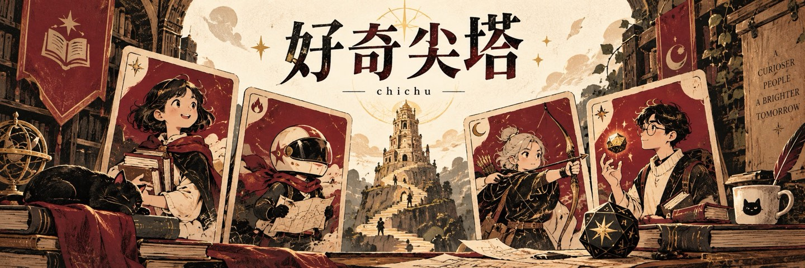

# 好奇尖塔 · Slay the Curiosity

**[▶ 在线试玩](https://agdafu.github.io/slay-the-curiosity/)** · [当前项目仓库](https://github.com/AGdafu/slay-the-curiosity)

这是一个把身边社群里熟悉的人，做成卡牌与技能的游戏尝试。灵感来自《杀戮尖塔》，也来自我对“熟悉的人出现在游戏里会是什么样”的好奇。

## 建议这样体验

打开试玩页，跟随游戏界面开始一局，观察角色、卡牌效果与社群梗如何结合。当前试玩由接手项目的同学维护，界面与内容可能继续变化。

## 我的参与与创作过程

我参与了早期版本的创作，试着把现实里人的特点转成游戏里的能力。对我来说，有意思的不是把名字贴到卡牌上，而是让熟悉这个人的玩家觉得“这个技能确实很像他”。社群里有人愿意玩，让这种创作不再只是自己觉得有趣。

随后项目交给同学继续推进。链接中的当前代码包含后续贡献，不把整个仓库、所有后续功能与维护都算作我的独立成果。

## 遇到的问题与收获

熟人梗能带来第一眼的亲切感，但要成为游戏，仍需要规则和反馈支撑。这个尝试让我更关注怎样把人物特征变成可玩的机制，也让我体会到，把一个创意交接给别人继续做，说明和贡献边界同样重要。

封面为项目概念图，不是实际游戏截图。本页记录我的早期参与，当前实现请以维护仓库为准。

[返回作品集](../README.md)
